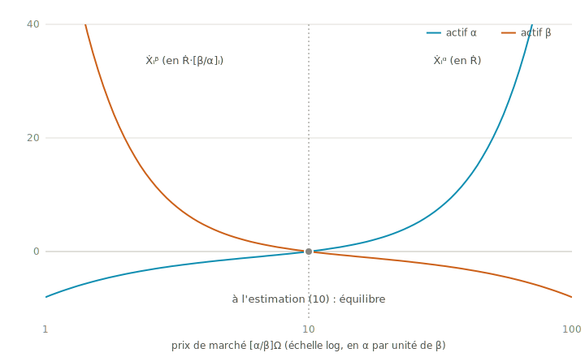
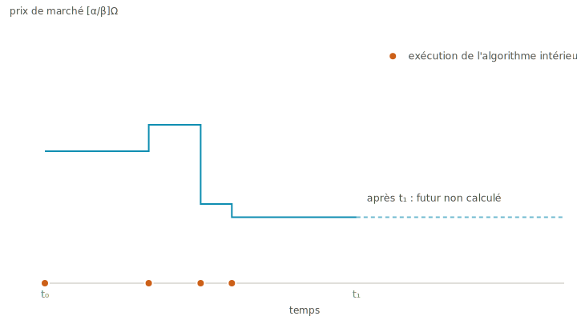

# Le \$tôkEx

Ceci est le \$tôkEx expliqué à ma façon — les mêmes mathématiques et les mêmes algorithmes que la publication officielle, racontés pour comprendre. Le document standard, celui qui constitue l'art antérieur, vit dans [`stokex/`](stokex/) : *The \$tôkEx Algorithm* (mémoire original de l'Opératrice, janvier 2022 ; publication défensive Smoothop, 2026 — lien et date d'horodatage à sceller à la soumission TDCommons).

D'abord, le nom. **\$tôkEx** juxtapose les deux monnaies du marché — le dollar et le tôk — suivies de « Ex » pour *exchange*. Ça se prononce **[stɔkɛks]** : le \$ se lit « S ».

## 1. Les neuf principes, en deux classes

**Le portefeuille**, d'abord : chaque participant en détient un — un compte par actif, de soldes $n^\alpha$ et $n^\beta$. Les soldes individuels évoluent en continu au gré des échanges (et des dépôts et retraits du participant) — mais, dépôts et retraits mis à part, la **somme** de chaque actif sur l'ensemble des portefeuilles reste constante : $\sum_i n^\alpha_i$ et $\sum_i n^\beta_i$ sont les invariants de l'échange.

**Le marché équitable** — le marché ne favorise personne et ne crée rien :

1. **Équilibre.** Le prix de marché est celui où l'offre rencontre la demande, pour les deux actifs : $\sum_i \dot X_i^\alpha = \sum_i \dot X_i^\beta = 0$.
2. **Échange au prix de marché.** À tout instant, un seul prix, strictement positif, commun à tous — et tout échange s'y fait exactement : $[\alpha/\beta]_\Omega = -\,\dot X_i^\alpha/\dot X_i^\beta > 0$.
3. **Aucun biais entre participants.** Toutes les vitesses viennent d'une seule fonction commune des entrées du participant et de l'état du marché : $\dot X_i^\alpha = F([\alpha/\beta]_i,\ \theta_i\ ;\ [\alpha/\beta]_\Omega)$, la même $F$ pour tout $i$.
4. **Aucun biais entre actifs.** Les équations sont invariantes sous l'échange $\alpha \leftrightarrow \beta$ (donc $[\alpha/\beta] \leftrightarrow [\beta/\alpha]$).
5. **Conservation.** Rien ne se crée ni ne se détruit — dépôts et retraits mis à part : $\frac{d}{dt}\sum_i n_i^\alpha = \frac{d}{dt}\sum_i n_i^\beta = 0$. *(Vu le principe 2, c'est la même équation que le principe 1 : le prix de marché existe précisément pour que la conservation tienne.)*

**Le marchand rationnel** — le comportement commun de tout participant, incarné par la *fonction de marchand*. Soit $x_i := [\alpha/\beta]_\Omega/[\alpha/\beta]_i$ le rapport entre le prix de marché et l'estimation :

6. **Acheter bas.** Le marché prise l'actif sous l'estimation → le participant achète : $x_i < 1 \Rightarrow \dot X_i^\beta > 0$ (et $\dot X_i^\alpha < 0$).
7. **Vendre haut.** Au-dessus → il vend ; à l'estimation, il ne fait rien : $x_i > 1 \Rightarrow \dot X_i^\beta < 0$ (et $\dot X_i^\alpha > 0$) ; $x_i = 1 \Rightarrow \dot X_i^\alpha = \dot X_i^\beta = 0$.
8. **L'urgence croît avec l'écart.** $\dot X_i^\alpha$ est strictement croissante en $x_i$ — la vitesse grandit quand $x_i$ s'éloigne de 1, d'un côté comme de l'autre.
9. **L'urgence croît avec la certitude.** $\dot X_i \propto w(\theta_i)$, avec $w$ strictement croissante et $w(0) = 0$ — sans conviction, pas d'échange.

Ces neuf principes sont les **hypothèses** du \$tôkEx : tout le reste est construit pour les satisfaire. La fonction de marchand réalise 6-9, la paire de vitesses symétriques réalise 2-4, le prix de marché réalise 1 et 5.

## 2. Notation et objets

| Symbole | Sens |
|---|---|
| $\alpha,\ \beta$ | les deux actifs fongibles (ex. tôk et dollar) |
| $[\alpha/\beta]$ | valeur d'une unité de $\beta$, exprimée en $\alpha$ ($[\beta/\alpha] = [\alpha/\beta]^{-1}$) |
| $[\alpha/\beta]_i,\ \theta_i$ | estimation du participant $i$, et son degré de certitude $\in [0,\ 100)\ \%$ |
| $w_i$ | poids du participant $i$ |
| $\dot X^\alpha_i,\ \dot X^\beta_i$ | vitesses d'échange du participant $i$ (unités de $\alpha$/temps et $\beta$/temps) |
| $n^\alpha_i,\ n^\beta_i$ | soldes des deux comptes du participant $i$ |
| $\dot R$ | vitesse d'échange de référence, constante et commune (en $\alpha$/temps) |
| $?_\Omega$ | grandeur de marché (prix $[\alpha/\beta]_\Omega$, poids $W_\Omega$, …) |

Les échanges sont **continus** : plutôt qu'une transaction ponctuelle, un participant échange à une *vitesse* qui s'ajuste d'elle-même — il achète ou vend automatiquement plus vite quand le prix lui est favorable (principe 8), ce qui étale ses transactions dans le temps et stabilise le marché.

## 3. Les vitesses d'échange

$$\dot X^\alpha_i = w_i\, f\!\left(\frac{[\alpha/\beta]_\Omega}{[\alpha/\beta]_i}\right)\dot R\,,\qquad \dot X^\beta_i = w_i\, f\!\left(\frac{[\beta/\alpha]_\Omega}{[\beta/\alpha]_i}\right)\dot R\,[\beta/\alpha]_i\,,\qquad f(x) = x^2 - \frac{1}{x}$$

Les deux équations sont **parfaitement symétriques** — la même à l'échange près de $\alpha$ et $\beta$ (principe 4) ; la même fonction pour tous (principe 3). $f$ est strictement croissante, négative sous 1, nulle en 1, positive au-delà : elle encode les principes 6-7-8 (« buy low, sell high », automatiquement).

**Théorème (échange au prix de marché).** Les deux vitesses satisfont identiquement

$$[\alpha/\beta]_\Omega = -\,\frac{\dot X^\alpha_i}{\dot X^\beta_i}$$

— ce qu'un participant reçoit d'un actif, il le paie de l'autre, exactement au prix de marché (principe 2). *Preuve : algébrique directe, en développant $f$ et en utilisant $[\beta/\alpha] = [\alpha/\beta]^{-1}$.*

<picture>
  <source media="(prefers-color-scheme: dark)" srcset="figures/stokex-reponse-dark.svg">
  
</picture>

*Courbes de réponse d'un participant ($[\alpha/\beta]_i = 10$, $\theta_i = 75\ \%$), chaque vitesse dans l'unité de référence de son actif ($\dot R$ pour $\alpha$, $\dot R\,[\beta/\alpha]_i$ pour $\beta$). En échelle logarithmique du prix, les deux courbes sont **images miroir** l'une de l'autre autour de l'équilibre — c'est le principe 4 rendu visible : $\dot X^\beta_i/(\dot R[\beta/\alpha]_i) = w_i f(1/x)$ quand $\dot X^\alpha_i/\dot R = w_i f(x)$.*

## 4. Le degré de certitude est un angle

Sur axes normalisés $x = [\alpha/\beta]_\Omega/[\alpha/\beta]_i$, $y = \dot X^\alpha_i/\dot R$, la courbe de réponse du participant est $y = w_i(x^2 - 1/x)$. Sa pente au point d'équilibre ($y=0$, soit $x=1$) vaut

$$\left.\frac{dy}{dx}\right|_{y=0} = 3\,w_i =: \tan(\theta_i)$$

Le degré de certitude $\theta_i$ **est l'angle d'attaque** de la courbe de réponse à l'équilibre — d'où le facteur $\tfrac13$. (Le même résultat tient en échelle logarithmique en $x$.) En applatissant $[0, \pi/2)$ sur $[0, 100)\ \%$ :

$$w(\theta) = \tfrac{1}{3}\tan\!\left(\frac{\pi\,\theta}{200\ \%}\right),\qquad \theta(w) = \frac{200\ \%}{\pi}\arctan(3w)$$

$\theta = 0$ : poids nul (aucune conviction, aucun échange). $\theta = 50\ \%$ : $w = \tfrac13$. $\theta \to 100\ \%$ : $w \to \infty$ — la certitude absolue est interdite (plafond en pratique, § 8).

## 5. Le prix de marché

Le prix d'équilibre annule l'offre et la demande nettes **des deux actifs** (principe 1) :

$$\sum_i \dot X^\alpha_i = \sum_i \dot X^\beta_i = 0 \iff \boxed{\ [\alpha/\beta]_\Omega = \left(\frac{\sum_i w_i\,[\alpha/\beta]_i}{\sum_i w_i\,[\beta/\alpha]_i^2}\right)^{1/3}}$$

*Dérivation :* $\sum_i w_i\left([\beta/\alpha]_i^2 - [\beta/\alpha]_\Omega^3\,[\alpha/\beta]_i\right) = 0$ se résout en la forme encadrée ; l'annulation côté $\beta$ suit du théorème d'échange au prix de marché. La somme croissante en $[\alpha/\beta]_\Omega$ garantit l'**unicité** du prix positif — précisément : si les estimations sont strictement positives, les poids non négatifs et qu'au moins un poids est strictement positif, il existe exactement un prix d'équilibre (preuve en annexe du papier ; théorème `market_price_unique` vérifié en Lean). Seuls comptent les participants effectivement capables d'échanger (§ 7). Si tous s'accordent, $[\alpha/\beta]_\Omega = [\alpha/\beta]_i$ ; marché vide : prix par défaut 1, poids nul.

## 6. Le marché est un participant

**Théorème.** Il existe un poids total $W_\Omega$ tel que, face à tout prix externe $[\alpha/\beta]_z$, le marché entier réagit comme un participant unique d'estimation $[\alpha/\beta]_\Omega$ et de poids $W_\Omega$ :

$$\sum_i w_i\, f\!\left(\frac{[\alpha/\beta]_z}{[\alpha/\beta]_i}\right) = W_\Omega\, f\!\left(\frac{[\alpha/\beta]_z}{[\alpha/\beta]_\Omega}\right),\qquad W_\Omega = [\beta/\alpha]_\Omega \sum_i w_i\,[\alpha/\beta]_i = [\alpha/\beta]_\Omega^2 \sum_i w_i\,[\beta/\alpha]_i^2$$

Un nouveau venu ne peut pas distinguer une foule diverse d'un participant unique $([\alpha/\beta]_\Omega,\ \Theta_\Omega)$, où $\Theta_\Omega = \frac{200\ \%}{\pi}\arctan(3W_\Omega)$ est le **degré de certitude du marché**. $W_\Omega$ mesure la **rigidité** du prix : plus il est grand, plus le marché résiste ; il croît avec chaque participant — un \$tôkEx populeux est un \$tôkEx stable.

Outils dérivés :

- **Mise à jour incrémentale** — si le participant $j$ passe de $([\alpha/\beta]_{j_1}, w_{j_1})$ à $([\alpha/\beta]_{j_2}, w_{j_2})$ :
$$[\alpha/\beta]_{\Omega_2} = \left(\frac{W_{\Omega_1}[\alpha/\beta]_{\Omega_1} - w_{j_1}[\alpha/\beta]_{j_1} + w_{j_2}[\alpha/\beta]_{j_2}}{W_{\Omega_1}[\beta/\alpha]_{\Omega_1}^2 - w_{j_1}[\beta/\alpha]_{j_1}^2 + w_{j_2}[\beta/\alpha]_{j_2}^2}\right)^{1/3}$$
- **Participant moyen** : $w_\Omega = W_\Omega/N_\Omega$, $\theta_\Omega = \frac{200\ \%}{\pi}\arctan(3w_\Omega)$ — comparable entre sous-groupes.
- **Variance analogue des estimations** : en lisant $[\alpha/\beta]_\Omega = \sum_i \frac{w_i}{W_\Omega}[\alpha/\beta]_i$ comme une espérance pondérée,
$$\sigma^2_{[\alpha/\beta]} = \frac{1}{W_\Omega}\sum_i w_i\,[\alpha/\beta]_i^2 - [\alpha/\beta]_\Omega^2$$
(analogie à manier avec précaution — les $w_i/W_\Omega$ ne sont pas des probabilités — mais utile pour lire la dispersion du marché.)

## 7. Les algorithmes

L'état du marché (prix, vitesses) est **constant par morceaux** : il ne change que lorsqu'un participant agit (consulter, déposer/retirer, changer d'estimation ou de certitude) ou qu'un compte se vide. Entre deux événements, tout est analytique.

**Temps d'épuisement.** Le compte qui se vide est celui de l'actif vendu ($\dot X_i < 0$) : $\Delta t_i = -\,n_i/\dot X_i$ (sinon $+\infty$).

**Algorithme intérieur** — état du marché à l'instant $t$ :

```text
exclure du marché tout participant ayant un compte vide → liste à vérifier
calculer le prix [α/β]_Ω sur les participants restants
trier la liste par estimation croissante
tant que la liste n'est pas vide :
    évaluer f aux deux bouts de la liste ; i* ← le bout le plus « loin » du prix (|f| max)
    s'il détient l'actif qu'il veut vendre à ce prix : le réintégrer, mettre à jour le prix (O(1))
    le retirer de la liste
calculer les vitesses Ẋ_i (nulles pour les exclus) et les Δt_i
```

Vérifier toujours le plus éloigné d'abord garantit que chaque vérification reste valide malgré les réintégrations — et comme $f$ est monotone en l'estimation, le plus éloigné est toujours à **l'un des deux bouts** de la liste triée : chaque pas coûte $O(1)$, le tri $O(N\log N)$, et c'est lui qui domine.

**Algorithme extérieur** — évolution de $t_0$ à $t_1$ :

```text
exécuter l'algorithme intérieur ; Δt ← min_i Δt_i
tant que t + Δt ≤ t_1 :
    avancer tous les soldes : n_i ← n_i + Ẋ_i·Δt ; t ← t + Δt
    exécuter l'algorithme intérieur ; Δt ← min_i Δt_i
avancer les soldes jusqu'à t_1
```

Le marché saute d'événement en événement — exactement, sans pas de temps arbitraire.

<picture>
  <source media="(prefers-color-scheme: dark)" srcset="figures/stokex-pas-dark.svg">
  
</picture>

*Le prix de marché est constant par morceaux : l'algorithme intérieur s'exécute à chaque événement (points), et entre deux événements, tout est analytique.*

## 8. L'instance du système des tôks

Dans le système des tôks : $\alpha$ = le tôk, $\beta$ = une monnaie étrangère (« dol » : CAD, EUR, …), un marché par monnaie, le tôk pour numéraire commun. Paramètres de l'implémentation de référence :

- $\dot R = \dot\Lambda$ : la vitesse de référence est **le débit du revenu universel** — le marché s'écoule au rythme du temps humain (voir `Toks.md`).
- Estimations bornées $10^{-6} \le [\text{tôk}/\text{dol}]_i \le 10^{6}$ ; certitude discrétisée au pas de $10^{-4}$, plafonnée à $99{,}9999\ \%$ (poids max $\approx 2{,}1\times10^{5}$).
- Prix par défaut : $1$ tôk/dol (marché vide).
- Chaque participant détient une paire de conts de marché (X_TOK, X_DOL) de même propriétaire ; seuils de solvabilité par tolérance de monnaie.
- Numérique : mises à jour en $O(N \log N)$ au total (la liste de solvabilité se traite triée par estimation — le plus éloigné du prix est toujours à l'un de ses deux bouts ; la mise à jour d'un participant seul reste $O(1)$ par la formule incrémentale), précision étendue, **sommation compensée de Kahan** sur les deux accumulateurs $\sum w_i v_i$ et $\sum w_i v_i^{-2}$.
- La fonction de marchand s'évalue en **forme décalée** : $x = p - 1$, puis $f = x(x^2+3x+3)/p$ — précision machine partout, y compris en $p \approx 1$, *le* cas typique (estimation proche du prix), là où $p^2 - 1/p$ perd jusqu'à la moitié de ses chiffres par annulation catastrophique. Deux subtilités mesurées : le dénominateur doit être $p$ (pas $x{+}1$, qui coûte $10^{-11}$ au bord du domaine), et la soustraction $x = p-1$ est *exacte* pour $p \in [\tfrac12, 2]$ (lemme de Sterbenz). Sans branchement, temps constant.
- La participation peut être restreinte par la gouvernance (implémentation actuelle : les personnes physiques et un unique comité désigné).

## 9. La divulgation officielle

La divulgation défensive est le document standard [`stokex/stokex_defensive_publication.pdf`](stokex/stokex_defensive_publication.pdf) (source LaTeX et figures incluses dans le même dossier). Il décrit l'algorithme tel qu'éprouvé, coefficients compris — pour tout couple d'actifs fongibles et toute vitesse de référence — avec les preuves en annexes. Dès sa publication horodatée sur TDCommons, ce qu'il décrit est de l'art antérieur, pour toujours.

---

Le progrès doit être moral, sinon ValueError!
