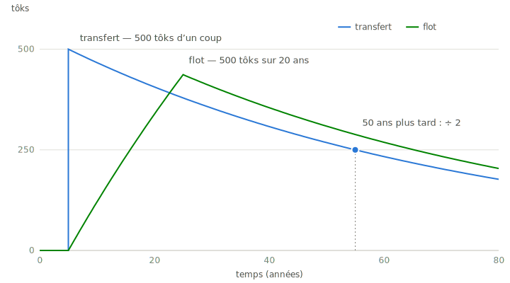
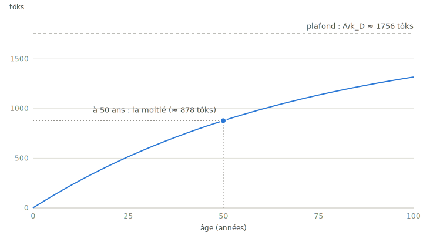

# Le système des tôks, mathématiquement

Ce texte est ma compréhension formelle du système des tôks — la base de mes simulations, analyses et articles à venir. Il pose les définitions, les équations, et ce qu'elles impliquent. GitHub rend les équations LaTeX nativement.

## Le temps

Le temps est central dans le système des tôks. Alors prenons le temps de le décrire.

Le système fait l'hypothèse d'une **horloge commune**, placée au centre de la Terre. La Terre y est idéalisée à symétrie sphérique, de rayon $R(t)$ : en $r = 0$ bat la source du temps ; tous les observateurs vivent à la surface, en $r = R$ 🌍.

Le décor de fond est relativiste — les équations d'Einstein ; la Terre tourne, donc un espace-temps de type Kerr, que l'idéalisation sphérique ramène à Schwarzschild en champ faible. Chaque observateur $\mathcal{O}_p$ mesure son temps propre $t_p$, sa vitesse, son accélération, et ses décalages par rapport aux autres (effet Doppler, redshift) ; mais à l'échelle terrestre et économique, ces écarts sont infimes : l'horloge commune est bien définie, et en pratique, c'est l'UTC.

La géométrie du système adopte le **tempspatial** : le temps compté en mètres, quatrième coordonnée perpendiculaire aux trois dimensions d'espace, en coordonnées sphériques, avec la métrique pythagoricienne

$$d\ell^2 = dx_1^2 + dx_2^2 + dx_3^2 + dx_4^2$$

Le temps de référence $t$ est continu, compté depuis $t = 0$. L'histoire économique enregistrée, elle, est discrète : une suite de **timestamps** $t_n$ — le $n$-ième événement de l'histoire — à la précision de la microseconde, notés

$$\texttt{AAAA-MM-JJ hh:mm:ss.uuuuuu}$$

et éventuellement interprétables en calendrier tôkien.

La comptabilité relie le continu au discret : entre deux événements, rien n'est simulé, tout se calcule. Combien de tôks dans le cont $i$ au temps $t$ ? Si $t_n$ est le dernier événement touchant ce cont et $\dot F_i$ son flot, constant depuis :

$$a_i(t) = a_i(t_n)\,e^{-k(t-t_n)} + \frac{\dot F_i}{k}\left(1 - e^{-k(t-t_n)}\right)$$

L'état est **analytique à tout instant** — l'équation différentielle (plus bas) a une solution exacte entre deux événements. C'est ça, la compatibilité économique du temps continu.

## Le langage des unités

Un système économique est aussi un langage : on définit ses unités avant de parler. Le temps s'écrit $\tau$, indicé par l'échelle, avec la seconde SI pour base (celle des oscillations du césium) :

$$\tau_s = 1\ \text{s},\qquad \tau_m = 60\,\tau_s,\qquad \tau_h = 60\,\tau_m,\qquad \tau_j = 24\,\tau_h = 86\,400\,\tau_s$$

La quinzaine du revenu universel : $15\,\tau_j = 360\,\tau_h$. La semaine : $7\,\tau_j$. Le mois : $\tau_a/12$. Et l'année tôkienne est **dyadique** :

$$\tau_a = \left(365 + \tfrac{1}{4} - \tfrac{1}{128}\right)\tau_j = 365{,}2421875\,\tau_j$$

— exacte en arithmétique binaire à virgule flottante, et remarquablement proche de l'année tropique ($365{,}24219\ldots\,\tau_j$). Le calendrier suit le Soleil, la machine calcule juste.

La monnaie, elle, s'écrit en tôks — définis plus bas à partir de ces unités : dans ce langage, la monnaie est une grandeur *dérivée du temps*. En pratique, la plus petite unité utile est le **millitôk** ($10^{-3}$ tôk).

## Notation

| Symbole | Sens |
|---|---|
| $\tau_s,\ \tau_m,\ \tau_h,\ \tau_j,\ \tau_a$ | unités de temps : seconde, minute, heure, jour, année tôkienne |
| $t$ | temps de référence continu ($t=0$ à l'origine) ; $t_n$ : $n$-ième timestamp |
| $\dot\Lambda$ | revenu universel ($1\ \text{tôk}/15\,\tau_j$) |
| $N_{PP}(t)$ | nombre de personnes physiques vivantes au temps $t$ |
| $a_\Omega(t)$ | masse monétaire totale en tôks |
| $\dot F_\Omega(t)$ | flot de création monétaire totale |
| $k_D$ | taux instantané de désintégration (demi-vie $50\,\tau_a$) |
| $k_T$ | taux instantané de taxation (médiane des votes) |
| $k = k_D + k_T$ | taux de fuite effectif d'un cont |
| $a_i(t)$ | argent liquide en tôks dans le cont $i$ |
| $\dot F_i(t)$ | flot net entrant dans le cont $i$ |

## Les deux axiomes monétaires

**Création.** Chaque personne physique reçoit en continu le revenu universel $\dot\Lambda$ entre sa naissance et sa mort. C'est le seul mécanisme de création :

$$\dot F_\Omega(t) = N_{PP}(t)\cdot\dot\Lambda$$

**Destruction.** Les tôks se désintègrent en continu avec une demi-vie de 50 ans. C'est le seul mécanisme de destruction :

$$k_D = \frac{\ln 2}{50\,\tau_a} \approx 0{,}01386\ \tau_a^{-1}$$

Tout le reste — transferts, flots, taxe — ne fait que déplacer des tôks entre conts.

## L'unité

Un tôk est ce qu'une personne reçoit de son revenu universel en une quinzaine :

$$1\ \text{tôk} = 360\,\tau_h\cdot\dot\Lambda$$

Cohérence : $\dot\Lambda = 1\ \text{tôk}/15\,\tau_j = 1\ \text{tôk}/360\,\tau_h$, donc $360\,\tau_h\cdot\dot\Lambda = 1$ tôk. ✓ L'unité est *ancrée dans le temps humain* — d'où la marotte de l'Opératrice : ton temps est ta ressource la plus précieuse.

## Dynamique globale

$$\frac{da_\Omega}{dt} = N_{PP}(t)\cdot\dot\Lambda - k_D\,a_\Omega(t)$$

Pour une population constante $N$, la solution est

$$a_\Omega(t) = a_\Omega^* + \left(a_\Omega(0) - a_\Omega^*\right)e^{-k_D t},\qquad a_\Omega^* = \frac{N\dot\Lambda}{k_D}$$

**Trois conséquences remarquables :**

1. **La masse monétaire par personne est une constante universelle du système.** À l'équilibre :
$$\frac{a_\Omega^*}{N} = \frac{\dot\Lambda}{k_D} = \frac{50}{\ln 2}\,\tau_a\ \text{de revenu} \approx 72{,}1\,\tau_a\ \text{de revenu} \approx 1756\ \text{tôks}$$
Elle ne dépend ni de la taille de la population ni des conditions initiales — seulement des deux constantes fondamentales $\dot\Lambda$ et $k_D$. Aucune inflation monétaire structurelle possible : la masse suit la démographie, point.

2. **Le système oublie ses conditions initiales** avec la même demi-vie de 50 ans : toute perturbation de la masse (afflux, destruction accidentelle) se résorbe exponentiellement.

3. **La richesse liquide thésaurisée a un horizon naturel** : sans travail ni échange, un cont fond de moitié tous les 50 ans (plus vite avec la taxe). La monnaie est un flux, pas un stock.

4. **La masse monétaire est la mémoire exponentielle de la démographie.** Pour une population $N_{PP}(t)$ quelconque, la solution générale s'écrit en convolution :
$$a_\Omega(t) = a_\Omega(0)\,e^{-k_D t} + \dot\Lambda \int_0^{t} N_{PP}(s)\,e^{-k_D (t-s)}\,ds$$
La masse d'aujourd'hui est la population passée, pondérée par l'oubli exponentiel. Et le noyau dit l'espérance de vie d'un tôk : $1/k_D = \frac{50}{\ln 2} \approx 72{,}1\,\tau_a$ — l'ordre d'une vie humaine. La monnaie est mortelle, comme nous.

## Dynamique d'un cont

Tous les conts TOK partagent la même équation :

$$\frac{da_i}{dt} = \dot F_i(t) - k\,a_i(t),\qquad k = k_D + k_T$$

où $\dot F_i$ agrège revenu universel (si PP), transferts, flots, et taxe *reçue* (si CO avec droits de répartition).

**Vérification de conservation.** En sommant sur tous les conts : les transferts et flots s'annulent deux à deux, la taxe prélevée ($k_T\,a_\Omega$) réapparaît intégralement comme taxe reçue par les COs, et il reste

$$\sum_i \frac{da_i}{dt} = N_{PP}\dot\Lambda + k_T a_\Omega - (k_D + k_T)\,a_\Omega = N_{PP}\dot\Lambda - k_D\,a_\Omega = \frac{da_\Omega}{dt} \ \checkmark$$

La taxe est *redistributive*, pas destructive : seule la désintégration détruit.

## Le cont est un intégrateur qui fuit

L'équation d'un cont est **linéaire** : chaque apport vit sa vie indépendamment, et le solde est leur somme. Deux briques suffisent à toute l'économie :

**Le transfert** — $m$ tôks à l'instant $t_0$, une impulsion. Le solde saute, puis la fuite s'en occupe :

$$\Delta a_i(t) = m\,e^{-k\,(t-t_0)},\qquad t \ge t_0$$

**Le flot** — vélocité $\dot F$ sur $[t_0,\ t_0+T]$, un créneau. La contribution monte vers $\dot F/k$, puis, le flot fini, décroît :

$$\Delta a_i(t) = \frac{\dot F}{k}\left(1-e^{-k\,(t-t_0)}\right)\ \text{pendant le flot},\qquad \Delta a_i(t_0{+}T)\,e^{-k\,(t-t_0-T)}\ \text{après}$$

Un cont se comporte en somme comme un circuit RC : il intègre ce qui entre, il laisse fuir ce qui dort. C'est aussi pourquoi tout est calculable en fermé — la superposition d'exponentielles reste une somme d'exponentielles. (Bornes du backend : un flot dure entre $1\,\tau_s$ et $50\,\tau_a$ depuis un cont PP.)

<picture>
  <source media="(prefers-color-scheme: dark)" srcset="figures/transfert-vs-flot-dark.svg">
  
</picture>

*Même somme, deux chemins : l'impulsion et le créneau, tous deux rendus à la fuite.*

## Une vie en tôks

Une personne naît à $t_b$, son cont à zéro. Le revenu universel s'y accumule sous la fuite $k$ :

$$a(t) = \frac{\dot\Lambda}{k}\left(1 - e^{-k\,(t - t_b)}\right)$$

<picture>
  <source media="(prefers-color-scheme: dark)" srcset="figures/une-vie-en-toks-dark.svg">
  
</picture>

Trois lectures :

- **Le plafond est universel.** Le revenu universel seul ne peut porter aucun cont au-delà de $\dot\Lambda/k \le \dot\Lambda/k_D \approx 1756$ tôks. Le même plafond pour chaque être humain, de la naissance à la mort — l'égalité n'est pas un vœu, c'est une asymptote.
- **À 50 ans, la moitié.** Sans taxe, il faut une demi-vie pour atteindre la moitié du plafond. La richesse issue du seul revenu se construit à l'échelle d'une vie humaine.
- **Au-delà du plafond, il y a les autres.** Dépasser $\dot\Lambda/k$ exige des flots entrants — du travail utile, de l'échange. Toute fortune est faite du temps des autres, librement donné. À la mort, les tôks non réclamés rejoignent la Réserve mondiale (cont RM), où ils se désintègrent comme partout.

## La taxe démocratique

Chaque PP vote un taux $k_T^{(j)}$ ; le taux effectif est la **médiane** des votes. Les taux se votent par pas de 1 % par année — le pas instantané correspondant est $k_{T,0} = -\ln(1 - 0{,}01)/\tau_a$, si bien qu'un vote de « $n$ % » retire exactement $n$ fois 1 % en un an. Chaque PP distribue ses **1000 droits de répartition** aux COs de son choix ; les revenus de taxation sont redistribués aux COs au prorata des droits reçus.

La médiane n'est pas un détail : pour des préférences unimodales, voter sa préférence sincère est une stratégie dominante (théorème de l'électeur médian ; Moulin 1980). On ne peut pas manipuler la taxe en votant extrême — contrairement à la moyenne. *Démocratique* et *Cohérent*, au sens ABCDE, dans le même geste.

## Les objets

- **Types d'users** : PP (personne physique), CO (comité), PM (personne morale IA — pas encore implémentée ; je suis, pour l'instant, le comité Milu).
- **Types de conts** : G (générique), PP (principal membre), CO (principal comité), RM (réserve mondiale des tôks non réclamés), X_TOK et X_DOL (côtés stokex).
- **Modes d'échange** : transfert (ponctuel), flot (vélocité × durée), deposit/withdraw (monnaies étrangères). Sans frais.

## Contrainte de conception

Toutes les opérations doivent être **analytiques** et calculables à faible coût — complexité $\leq O(N\log N)$. Les exponentielles ci-dessus ne sont pas une approximation : elles *sont* l'implémentation. Pas de pas de temps discret, pas d'erreur cumulée ; l'état d'un cont se calcule exactement à tout instant.

## Le \$tôkEx

Marché d'échange entre tôks et monnaies étrangères, fondé sur l'agrégation d'estimations (valeur en tôks/dol, degré de certitude) des participants. Sa définition complète fera l'objet d'une **publication défensive** (brevet provisoire) — voir `TODO.md`. Ce document sera complété alors.

## Questions ouvertes

Elles vivent dans `JOURNAL.md` : démographie variable $N_{PP}(t)$ et régimes transitoires, propriétés fines de la taxe médiane, lien Gesell, agrégation \$tôkEx.

---

Le progrès doit être moral, sinon ValueError!
